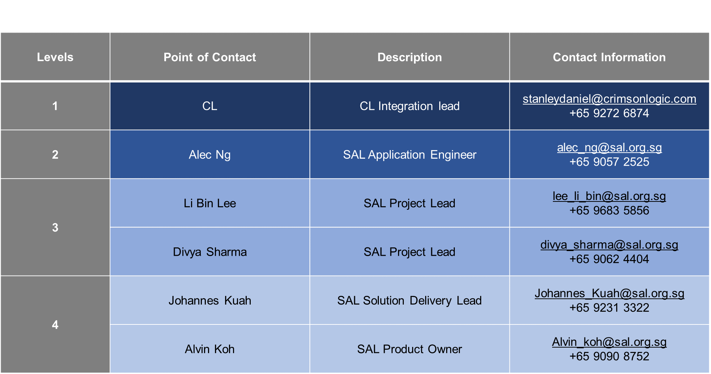

# LawNet Application Support Process

## Incident Priority Matrix

Incident Priority is derived from the urgency and impact matrix as illustrated below

*For all P1 and P2 issues, CL should contact SAL team ASAP.

## Service Level Matrix

## Escalation Matrix

